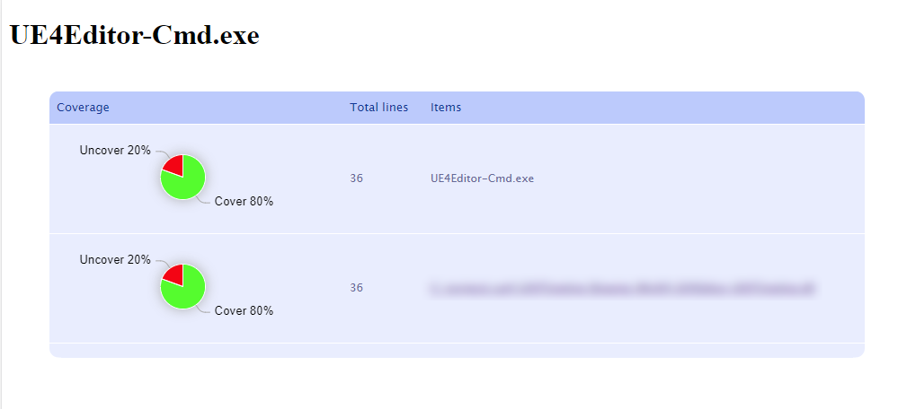

# UE4 template for c++ project with test environment


## Why?

My first needs were:

* improve my process of **proof concepting**
* try to reduce the **UE4 build** duration
* ensure quality to avoid regressions by **running tests frequently**

Then after reading this great serie of articles, testing and guiding by its author @[ericlemes](https://github.com/ericlemes):

* https://ericlemes.com/2018/12/12/unit-tests-in-unreal-pt-1/
* https://ericlemes.com/2018/12/13/unit-tests-in-unreal-pt-2/
* https://ericlemes.com/2018/12/17/unit-tests-in-unreal-pt-3/

this project came to life!

## Requirements

* [Unreal Engine](https://github.com/EpicGames/UnrealEngine)
* [UE4-GoogleTest](https://github.com/NansPellicari/UE4-GoogleTest) (but it is embeded as a gitmodule)
* [OpenCppCoverage](https://github.com/OpenCppCoverage/OpenCppCoverage/wiki)
* [NodeJs](https://nodejs.org/en/download/)
* [Pm2](https://pm2.keymetrics.io/)

## 1 - Clone to a specific dir

```powershell
git clone git@github.com:NansPellicari/UE4-TPL-CppWithTestEnv.git MyNewGame
# renaming destination folder is important, 'cause UE4 doesn't like dash in project name
cd MyNewGame
```

## 2 - Rename the project files

```powershell
.\ChangeProjectName.bat 'MyNewGame'
# and respond "y" in every prompt
# or
.\ChangeProjectName.bat -f 'MyNewGame'
# to avoid prompts
# or
.\ChangeProjectName.bat -f 'MyPreviousGameName' 'MyNewGame'
# if you've already change the name but you decide to change again
```

This will:
- cleans all unecessary files and folders (if exists: Binaries, Saved,...)
- prompts you to set the **UE4 root path**
- renames all `MyProject` files & folders
- changes all `MyProject` occurences in `./Source/`, `./Config/` and `./TestsReports/` directories.
- generate Project Files (for VS or VScode)

## 3 - Get submodules

This repo embeds [UE4-GoogleTest](https://github.com/NansPellicari/UE4-GoogleTest) plugins which is a **UE4 plugin**, a simple adapter for the [googletest](https://github.com/google/googletest) project.

```powershell
git sumbmodule init
git submodule update --init --recursive
```

## 4 - Test

Run all tests to check if all is well configure.

```powershell
.\RunTests.bat -b gg
.\RunTests.bat -b ue4 MyNewGame
# last parameter is recommended for this one (see section 4a),
# otherwise it launches every UE4 tests
```

> Each run will **builds** using the UE4 builder. `gg`: a **program** build, `ue4`: an **editor** build.  
> It means that the first time they are launch, they'll take time to build.  
> But on next runs you'll see how fast they are, it is such a pleasure :relaxed:  
> Special winner is the `gg` build :heart_eyes:


For the both builds (`ue4` or `gg`), you can filter **tests** to run.  

### 4a - Filter for UE4 build

For this build is really important to filter, otherwise it will run all Unreal Engine's tests, which is A LOT!  
You can add any filters you need as if:

```powershell
.\RunTests.bat -b ue4 MyNewGame MyPlugin.Core
```
> this will call `UE4Editor-Cmd.exe` with this parameter `-ExecCmds="Automation RunTests MyNewGame+MyPlugin.Core; quit"`

### 4b - Filters for GG build

Use params as [google test](https://github.com/google/googletest/blob/master/googletest/docs/advanced.md#selecting-tests) defined.  

```powershell
.\RunTests.bat -c -b gg --gtest_filter=FirstTest.*-FirstTest.ShouldTestFalse
```

> to list test names: `.\RunTests.bat -b gg --gtest_list_tests`  


## 5 - Coverage

Just add `-c` option:

```powershell
.\RunTests.bat -c -b gg
.\RunTests.bat -c -b ue4 MyNewGame
```

## 6 - Reinstall git + git modules on your new git repository

```powershell
rd .\git\
rd .\Plugins\GoogleTest
git init
git submodule add git@github.com:NansPellicari/UE4-GoogleTest.git Plugins/GoogleTest
git add .
git ci -m "Initial my UE4 project with GoogleTest + OpenCppCoverage"
git remote add origin https://github.com/MY_USER/MY_REPO.git
git push origin master
```

## 7 - Shutdown server

Don't forget to shutdown server when you don't use it or if you switch to other project.

```bash
cd TestsReports/
npm run server:stop
# or to ensure to kill every server
npm run server:clean
# or
pm2 delete all
```

## What does it look like?

### Google Test App reports

I choose to use [Xunit viewer](https://www.npmjs.com/package/xunit-viewer) 'cause (at the age of this repo creation):
* it is actively maintain
* is the most advanced UI on npm


### Google Test App Coverage


### UE4 reports


### UE4 Coverage



[License Apache-2.0](./LICENSE.md)